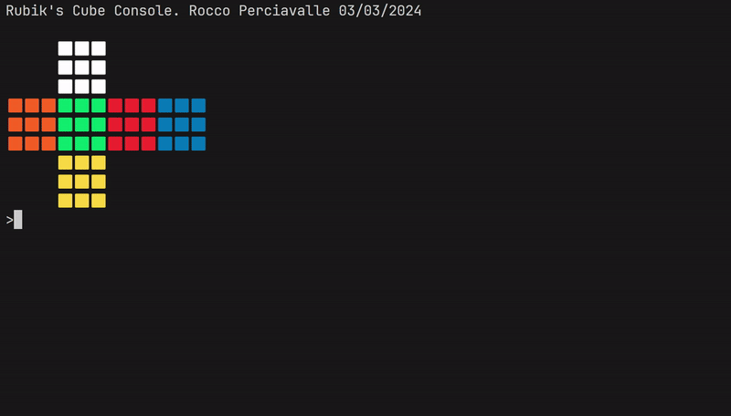

# Rubik's Cube Console

This project implements a Rubik's cube you can interface with on a command line. Currently it supports basic moves and algorithm inputs, and can solve a cube with the Old Pochmann method used commonly for solving a Rubik's cube blindfolded. I chose this method to implement first because it has no "freeform" or "intuitive" parts that would be difficult to implement programatically.

To build, run `make`. Currently, this project only runs on Linux/macOS due to the difference in input handling on Windows.

At the console, supported moves are `R, R', R2, L, L', L2, U, U', U2, D, D', D2, F, F', F2, B, B', and B2`. Typing any one of these will apply that move to the cube. You can also input any moves at once, separated by spaces.

To auto-solve the cube type `solve`. This will also generate and print the [letters and parity associated with the Old Pochmann method](https://www.speedsolving.com/wiki/index.php?title=Classic_Pochmann).

To watch the program solve the cube, you can type `solve slow` or `solve fast` which will solve the cube slow enough for you to see the progress.

In the future I plan to implement better solving methods, more flexibility (middle slice moves, rotations) and maybe even 3D graphics.
